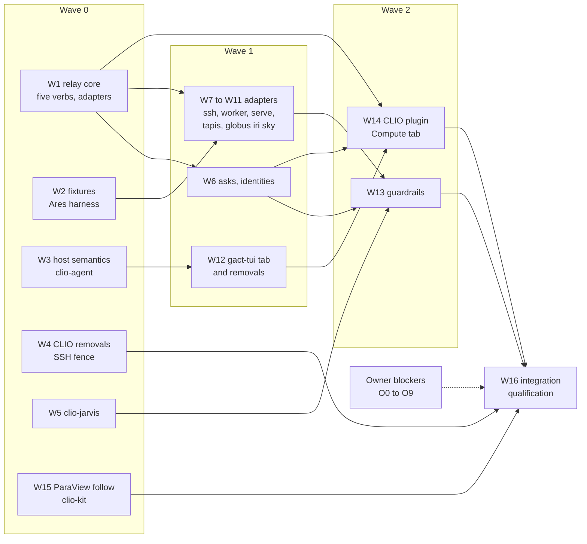

# Relay rework: workstreams overview

Target path in clio-relay: `docs/design/relay-rework-workstreams.md`. Detail is in `relay-rework-execution.md`.

```mermaid
flowchart LR
  subgraph w0[Wave 0]
    W1[W1 relay core<br/>five verbs, adapters]
    W2[W2 fixtures<br/>Ares harness]
    W3[W3 host semantics<br/>clio-agent]
    W4[W4 CLIO removals<br/>SSH fence]
    W5[W5 clio-jarvis]
    W15[W15 ParaView follow<br/>clio-kit]
  end
  subgraph w1[Wave 1]
    W6[W6 asks, identities]
    AD[W7 to W11 adapters<br/>ssh, worker, serve,<br/>tapis, globus iri sky]
    W12[W12 gact-tui tab<br/>and removals]
  end
  subgraph w2[Wave 2]
    W13[W13 guardrails]
    W14[W14 CLIO plugin<br/>Compute tab]
  end
  W16[W16 integration<br/>qualification]
  O[Owner blockers<br/>O0 to O9]

  W1 --> W6
  W1 --> AD
  W2 --> AD
  W3 --> W12
  W6 --> W13
  AD --> W13
  W5 --> W13
  W12 --> W14
  W6 --> W14
  W1 --> W14
  W15 --> W16
  W4 --> W16
  W13 --> W16
  W14 --> W16
  O -.-> W16
```
